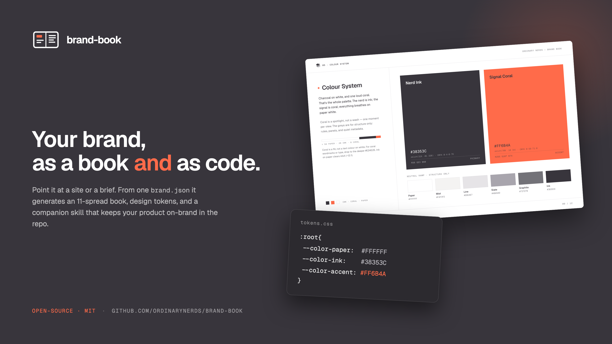
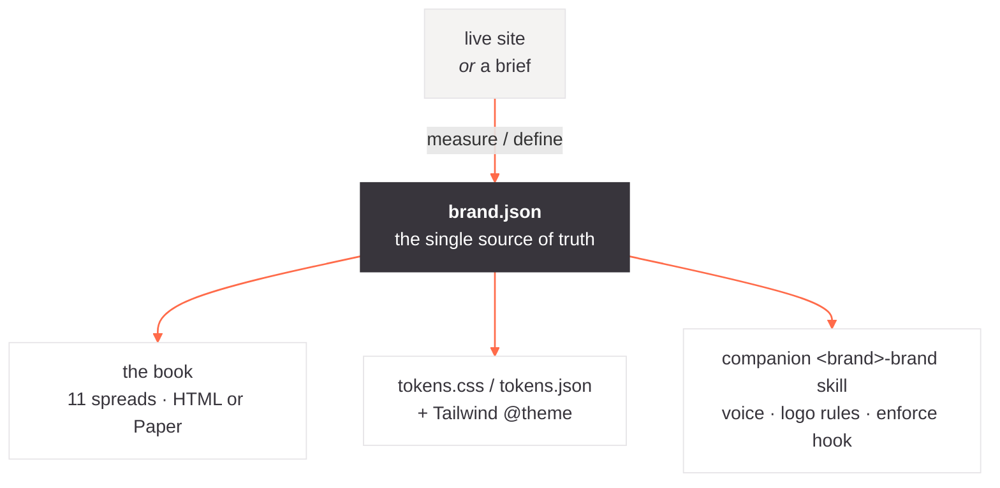

# brand-book



**An agent skill that turns a brand's raw assets into a real brand guidelines book —
and a skill that keeps that brand enforced in code.**

Give it a logo (and maybe a mascot), some colours, fonts, and a sense of voice. It
produces two things:

1. **The brand book** — an 11-spread, Swiss-editorial guidelines document.
2. **A companion `<brand>-brand` skill** — real token files, an enforceable voice, the
   SVG assets, and an optional lint hook, so a coding agent keeps the product on-brand.

### Two skills — pick your render target

This repo ships **two skills** that produce the same book, rendered differently:

| Skill | Output | Needs | Use it when |
|-------|--------|-------|-------------|
| **`brand-book-html`** *(default)* | one self-contained HTML file — open anywhere, print to PDF, publish as a Claude Artifact | just a browser | almost always |
| **`brand-book-paper`** | an editable [Paper](https://paper.design) design canvas → PDF | Paper desktop + its MCP | you want to hand-edit on a canvas |

The content, `brand.json`, taste rules, and companion-skill output are identical — only
the rendering differs. Reach for `brand-book-html` unless you specifically want Paper.

Built by [Ordinary Nerds](https://ordinarynerds.com?utm_source=github&utm_medium=readme&utm_campaign=brand-book). Works with Claude Code (or any
agent that loads skills). The brand can be your own or a client's — nothing here
assumes a client relationship.

---

## Table of contents

- [Why](#why)
- [Install](#install)
- [Use](#use)
- [How it works](#how-it-works)
- [`brand.json` — the source of truth](#brandjson--the-source-of-truth)
- [The book: 11 spreads](#the-book-11-spreads)
- [Rendering: two skills, one book](#rendering-two-skills-one-book)
- [The companion `<brand>-brand` skill](#the-companion-brand-brand-skill)
- [The enforcement hook](#the-enforcement-hook)
- [Scripts](#scripts)
- [Design principles it enforces](#design-principles-it-enforces)
- [Repo layout](#repo-layout)
- [Prior art](#prior-art)
- [License](#license)

---

## Why

Most "brand guidelines" fail one of two ways: they live in a design app almost nobody
has, or they're a PDF that rots the moment the product ships. This skill fixes both.

- **One source of truth.** Everything derives from a single machine-readable
  [`brand.json`](#brandjson--the-source-of-truth) — colours as semantic roles, type,
  logo, voice, layout. The book, the companion skill, and the token files are all
  *generated* from it, so they can't drift.
- **Measured, not guessed.** If the brand has a live site, the skill **measures** it
  (ranks the real colours, reads the real fonts) instead of hallucinating. Left alone,
  a model regresses to the mean — Inter, an indigo accent, a purple gradient — which is
  off-brand for everyone.
- **Self-contained.** The HTML book inlines its fonts and SVGs. No design tool, no CDN,
  no broken links. It opens offline and prints to PDF.
- **Operational.** The companion skill ships real `tokens.css`/`tokens.json`, an
  enforceable voice, and an optional hook that warns when an edit drifts off-brand.

---

## Install

With the [skills CLI](https://skills.sh):

```bash
npx skills add ordinarynerds/brand-book@brand-book-html    # the default
npx skills add ordinarynerds/brand-book@brand-book-paper   # only if you use Paper
```

Or copy the skill folder you want into your project (or `~`) at
`.claude/skills/brand-book-html/` (or `…/brand-book-paper/`).

**Requirements:** an agent that supports skills (e.g. Claude Code) and `python3` for the
scripts (standard library only — no dependencies). The HTML target needs only a browser;
the optional Paper target needs the Paper desktop app + its MCP server.

---

## Use

In Claude Code:

```
/brand-book-html      # or /brand-book-paper
```

…or just ask: *"turn these brand assets into guidelines,"* *"make a brand book and a
brand skill for Acme."* Have the brand's logo/mascot (SVG is best), colours, fonts, and
a sense of voice ready — or just point it at the brand's website and let it measure.

The skill will: post a **design brief** for your sign-off → normalize the assets → write
`brand.json` → build the book spread by spread (screenshotting to self-review) → produce
the HTML (or Paper) book → generate the companion `<brand>-brand` skill.

---

## How it works



1. **Intake → `brand.json`.** Measure a live site (resolve the seven colour roles by
   frequency, harvest fonts/logo/imagery) or take a structured brief. Score confidence
   and raise **open questions** for anything ambiguous — a recommendation to confirm or
   override, never a dead end. See [`references/intake.md`](brand-book-html/references/intake.md).
2. **Assets.** Normalize the marks with [`svgkit`](#scripts): extract the symbol out of
   the wordmark, unify inks, emit ink/white/accent variants, slice a mascot sprite row
   into tight uniform slices.
3. **Tokens.** Generate `tokens.css` + `tokens.json` from `brand.json` with
   [`gen_tokens`](#scripts).
4. **Build.** 11 landscape spreads (1440×900), same content either way — [HTML
   (default)](brand-book-html/references/build-html.md) or [Paper (optional)](brand-book-paper/references/build-paper.md).
   Built incrementally with a self-review checklist after each spread.
5. **Review & export.** Reconcile cross-spread consistency (page numbers, clear-space,
   tagline). HTML prints to PDF or publishes as an Artifact; Paper exports a PDF.
6. **Companion skill.** Emit `<brand>-brand/` (usually in the brand's own repo) so the
   book becomes enforceable in code.

---

## `brand.json` — the source of truth

The whole brand in one machine-readable file. Author it once; generate everything from
it. Full schema and rules: [`references/brand-json.md`](brand-book-html/references/brand-json.md).

Colours are **seven semantic roles** (`background`, `surface`, `border`, `muted`,
`foreground`, `accent`, optional `accent-secondary`) with **hex + OKLCH** (and CMYK/
Pantone for print). Naming by role, not hue, means a rebrand is a value change, not a
rename.

```jsonc
{
  "name": "Acme",
  "tagline": "…", "mission": "…", "values": ["…"], "audience": "…",
  "colors": [
    { "role":"background","hex":"#FFFFFF","oklch":"oklch(100% 0 0)","name":"Paper","usage":"ground" },
    { "role":"foreground","hex":"#141413","oklch":"oklch(17% .005 90)","name":"Ink","usage":"text, marks" },
    { "role":"accent","hex":"#D97757","oklch":"oklch(67% .13 40)","name":"Clay","usage":"one moment per view (FILL)","accentText":"#B85C3E" }
    // …surface, border, muted…
  ],
  "typography": { "display": {…}, "body": {…}, "mono": {…}, "scale": {…} },
  "logo": { "primary":"assets/wordmark.svg","symbol":"assets/mark.svg","clearSpace":"1 mark-height","minSize":"24px","donts":[…] },
  "voice": { "weAre":[…], "weAreNot":[…], "vocabulary": {"use":[…],"avoid":[…]}, "registers":[…] },
  "layout": { "radius": {…}, "spacingBase":"8px" }
}
```

Rule: **never invent colours from memory.** Each value is measured or chosen; derive a
missing role from a measured one with `oklch()` and say so; mark inferred values.

---

## The book: 11 spreads

11 landscape spreads (1440×900) sharing a mono running-head + footer. Full layout & copy
per spread: [`references/spread-map.md`](brand-book-html/references/spread-map.md).

| # | Section | Spread |
|---|---------|--------|
| 01 | Introduction | What is `<Brand>`? — manifesto lead + hero mark |
| 02 | Introduction | Brand Principles (from `values`) |
| 03 | Logo System | Symbol Concept — the mark on a construction grid |
| 04 | Logo System | Logo Overview — lockups + reversal |
| 05 | Logo System | Do's & Don'ts — misuse grid + clear space + min size |
| 06 | Mascot / Illustration | The set (drop if the brand has no mascot) |
| 07 | Typography | Typeface — specimen + weight ladder |
| 08 | Typography | Hierarchy — the type scale |
| 09 | Colour System | Core palette + neutral ramp + usage/accessibility |
| 10 | Voice & Tone | Register(s) + the boundary rule + examples |
| 11 | Applications | Real collateral — banner, avatar, card, sticker |

Optional additions when the brand has them: Mission/Vision/Audience, print CMYK/Pantone,
iconography, social sizes, a quick-reference card.

---

## Rendering: two skills, one book

The two skills share everything except the render step:

|  | **`brand-book-html`** (default) | **`brand-book-paper`** |
|---|---|---|
| Needs | a browser | Paper desktop + its MCP |
| Output | one `.html` → Artifact / print-to-PDF | editable canvas → PDF export |
| Best for | most people, sharing a link, agentic pipelines | hand-editing on a canvas |
| Build guide | [`brand-book-html/references/build-html.md`](brand-book-html/references/build-html.md) | [`brand-book-paper/references/build-paper.md`](brand-book-paper/references/build-paper.md) |

Both carry the same `brand.json` schema, intake, spread map, design system, asset
pipeline, companion-skill generator, and `svgkit`/`gen_tokens` scripts — so a book reads
the same whichever you pick.

The HTML build is one self-contained file: tokens as `:root` custom properties, each
spread a real 1440×900 page that scales to any viewport and prints one-per-page, **fonts
inlined as `@font-face` data URIs** (the Artifact CSP blocks font CDNs), and every SVG
embedded. Author with relative paths, then run [`embed_assets`](#scripts) to inline
everything into a portable file.

A brand book is legitimately **single-theme paper** — it commits to a white-paper world
and sits the spreads on a neutral gallery ground, rather than shipping a half-baked dark
mode.

---

## The companion `<brand>-brand` skill

The operational half of the deliverable. Generated from `brand.json` and dropped into the
brand's own repo at `.claude/skills/<brand>-brand/`. Full spec + template:
[`references/companion-skill.md`](brand-book-html/references/companion-skill.md).

```
<brand>-brand/
  SKILL.md          human-readable index
  brand.json        the source of truth
  tokens.css        :root { --color-<role> … } + Tailwind @theme
  tokens.json       { color, font, text, radius, spacing }
  assets/           the real, final SVGs (durable home for the marks)
  hooks/enforce.sh  optional advisory brand-lint hook
```

It gives a coding agent:

- **Tokens** by role (`--color-paper`, `--color-ink`, `--color-accent`…), with the
  accent-once rule restated for UI.
- **Applying in code** for a new surface *or* an existing codebase — mapping the repo's
  tokens onto the brand roles **by usage evidence, not by value**, and leaving ambiguous
  ones for human review (never silently collapsing or inventing a token).
- **Logo & mascot usage** — which asset where, clear space, min size, the don'ts.
- **An enforceable voice** — a **We Are / We Are Not** table, vocabulary to use/avoid, the
  register boundary, and concrete **UI-copy rules** (action-verb buttons, errors that say
  what → why → next, active voice, dash/case conventions).
- **Accessibility** — the passing text/background pairs and the accent-as-text fallback.

---

## The enforcement hook

Every companion skill can ship `hooks/enforce.sh` — an **advisory** Claude Code
`PostToolUse` hook. On every Edit/Write it lints the touched file for **off-palette
colours** (any hex not in `tokens.json`) and **off-brand vocabulary** (from
`brand.json`'s `voice.vocabulary.avoid`). It reads both from the token files, so it can't
drift from the brand.

Wire it up by merging into `.claude/settings.json` (don't overwrite):

```jsonc
{ "hooks": { "PostToolUse": [ { "matcher": "Edit|Write",
  "hooks": [ { "type": "command",
    "command": "\"$CLAUDE_PROJECT_DIR/.claude/skills/<brand>-brand/hooks/enforce.sh\"" } ] } ] } }
```

Example output when an edit drifts:

```
[Acme brand] pricing.css:
  - off-palette colour #7A5CFF — use a --color-* token
  - off-brand word "supercharge" — see brand.json voice.vocabulary.avoid
```

Advisory by default (warns, never blocks). Set `ON_BRAND_STRICT=1` to make it block
(exit 2) instead. Dependency-free (bash + `python3`).

---

## Scripts

All stdlib Python, no dependencies.

### `svgkit.py` — measure and cut brand SVGs

Brand SVGs carry absolute coordinates and inconsistent inks; naive slicing leaves uneven
margins. `svgkit` reads the **vector path data** (never rasterize to measure —
thumbnailers square the canvas and blacken transparency).

```bash
svgkit clusters  row.svg                          # detect glyphs in a sprite row
svgkit slice-row row.svg --out ./o --name face    # tight, common-height slices + display widths
svgkit extract   wordmark.svg --out mark.svg --pick left   # pull the symbol out of a lockup
svgkit tight     mark.svg --out mark.svg           # crop the viewBox to the drawing
svgkit recolor   mark.svg --out mark-white.svg --map "#141413=#FFFFFF"
```

### `gen_tokens.py` — brand.json → token files

```bash
gen_tokens.py brand.json --out-dir .   # writes tokens.css (:root + @theme) + tokens.json
gen_tokens.py brand.json --print       # print the CSS to stdout
```

### `embed_assets.py` — make an HTML file self-contained

Inlines local ``, CSS `url()`, and `@font-face` as data URIs — required for
Artifacts, handy everywhere.

```bash
embed_assets.py book.src.html --out book.html
```

---

## Design principles it enforces

- **One accent, used once per view** — monochrome ink-on-paper is the ground; the accent
  is a spotlight, not a wash.
- **Extract the real mark** — the symbol usually lives *inside* the wordmark; don't grab
  a look-alike file.
- **Values are measured or chosen, never recalled** — colours/fonts from a live site or
  the brief, not memory.
- **Pure-white ground for a high-chroma accent**; a brand book is single-theme paper.
- **Calm, declarative book copy** — a separate loud/social voice is *documented*, never
  used to write the book.
- **Accessibility is a rule** — state the passing contrast pairs; ship a darker text-only
  variant when the accent fails as small text on white.

---

## Repo layout

Two self-contained skills. They share the reference set and the `svgkit`/`gen_tokens`
scripts; only the build reference (and `embed_assets`, HTML-only) differ.

```
brand-book-html/               the default skill (portable HTML output)
  SKILL.md                     the workflow + the taste rules
  references/
    brand-json.md              the brand.json source-of-truth schema
    intake.md                  measure a live site or take a brief -> brand.json
    spread-map.md              the 11 spreads, shared chrome, layout & copy
    build-html.md              render as a self-contained HTML artifact
    design-system.md           tokens, semantic colour roles, oklch, review checklist
    asset-pipeline.md          svgkit recipes + placement
    companion-skill.md         emit the <brand>-brand skill: tokens, voice, hook (+template)
  scripts/
    svgkit.py                  SVG toolkit: clusters / slice-row / extract / tight / recolor
    gen_tokens.py              brand.json -> tokens.css (+ Tailwind @theme) + tokens.json
    embed_assets.py            inline local imgs/fonts as data URIs -> self-contained HTML

brand-book-paper/              the Paper-canvas skill
  SKILL.md
  references/                  (same set, with build-paper.md instead of build-html.md)
  scripts/                     svgkit.py, gen_tokens.py
```

---

## Prior art

Method distilled from the best of the open agent-skills ecosystem, with thanks:

- **[open-design](https://github.com/nexu-io/open-design)** — `brand-extract` (measure a
  live site into a machine-readable kit; the seven colour roles) and `token-map`
  (evidence-based token-role mapping for existing codebases).
- **[extract-design-system](https://github.com/arvindrk/extract-design-system)** — ship
  real `tokens.json` / `tokens.css`, not paste blocks.
- **[getsentry/skills](https://github.com/getsentry/skills)** — a real company's
  two-register voice with concrete UI-copy rules.
- **[Anthropic brand-voice](https://github.com/anthropics/knowledge-work-plugins)** — the
  "voice constant, tone flexes" model, We-Are/We-Are-Not, confidence + open questions.
- **[claude-office-skills](https://github.com/claude-office-skills/skills)** — a thorough
  guidelines section outline (audience, print values, iconography, quick reference).

---

## License

[MIT](./LICENSE) © [Ordinary Nerds](https://ordinarynerds.com?utm_source=github&utm_medium=readme&utm_campaign=brand-book)
